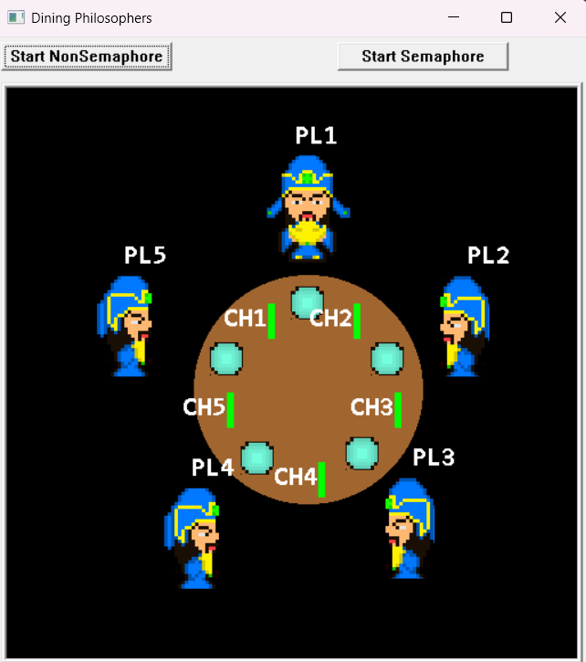
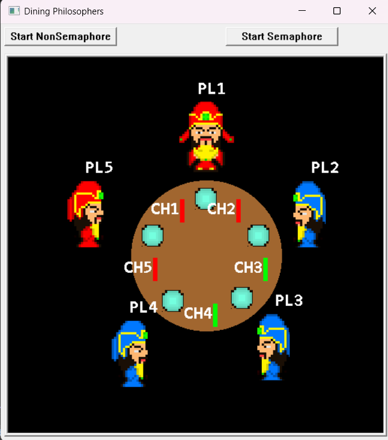
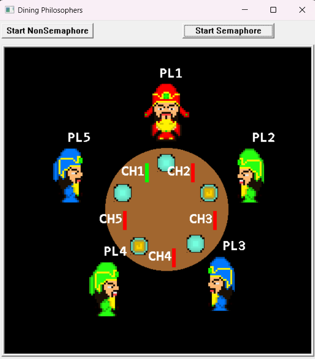
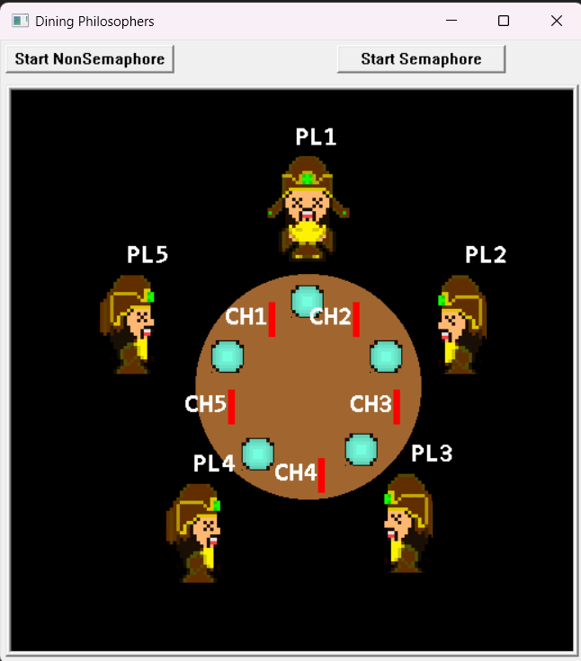

# Dining Philosophers - C++ Visual Implementation

This is a visual implementation of the famous **Dining Philosophers Problem** using C++. The project demonstrates how multiple threads interact with shared resources (forks) and simulates philosophers sitting at a table, eating spaghetti while avoiding deadlock and resource contention. The program uses graphical representations to visualize the actions of philosophers.

## Features

- **Multithreading**: Simulates philosophers as threads, each requiring two forks to eat.
- **Graphics**: The project includes visual elements like philosophers, forks, and eating animations.
- **Sound Effects**: Background sounds and actions added for a more interactive experience.
- **Deadlock and Starvation Prevention**: The solution is designed to avoid deadlocks and starvation through synchronization mechanisms.
- **Philosopher Positions**: Philosophers are placed around the table, and their activities (thinking, eating) are visualized.

## Installation & Setup

To run this project on your local machine, make sure you have a C++ compiler that supports multi-threading.

1. Clone the repository:
   ```bash
   git clone https://github.com/yourusername/dining-philosophers-cpp.git

2. Install the **ICbytes** library if it's not already installed:
   - Visit [ICbytes official documentation](https://otoidrak.com/doc/I-See-Bytes%20A%20Simplified%20C++%20Library.pdf) for installation instructions.
   - Visit [ICbytes Main Page](https://otoidrak.com/Yazilim.html)

## Images






## Contributors

👤 **Eren Karadeniz** - [GitHub](https://github.com/ErenKaradeniz0)  
👤 **Ulas Deniz Cakmazel** - [GitHub](https://github.com/UlasDenizCakmazel)  
👤 **Sevval Gur** - [GitHub](https://github.com/svvlgr)  

## License

📜 This project is licensed under the MIT License.
